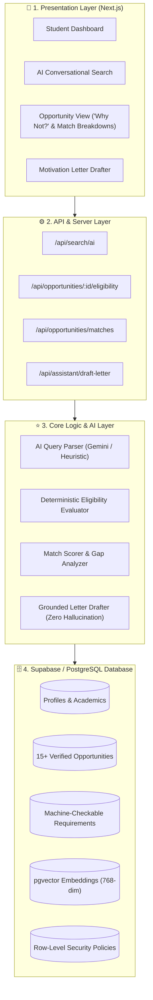

<div align="center">

# 🧭 NEXTPATH
### Opportunity-Intelligence & Application-Readiness Platform
**IMPACT 2026 Hackathon**

[](https://www.typescriptlang.org/)
[](https://supabase.com)
[](https://ai.google.dev/)
[](https://opensource.org/licenses/MIT)

<p align="center">
  <b>Turning <i>"I don't know what's out there"</i> into <i>"I know exactly what I should apply for next."</i></b>
</p>

[Key Features](#-key-features) •
[The Golden Rule](#-the-golden-rule) •
[Architecture](#-system-architecture) •
[Quickstart](#-quickstart--demo) •
[Data Models](#-data-models--contracts) •
[Team Integration](#-team-integration-guide)

---

</div>

## 📌 Problem & Insight
Students today don't lack opportunities — **they lack opportunity intelligence**.
1. **Discovery Gap**: Opportunities are scattered across Telegram channels, Facebook groups, and university portals.
2. **Eligibility Gap**: Students waste hours applying for programs they were never qualified for.
3. **Action Gap**: Drafting repetitive motivation letters and tracking uncoordinated deadlines from scratch.

**NEXTPATH fixes this** with a verified opportunity repository, a mathematical rule-based eligibility engine, and an AI-assisted application copilot.

---

## ⚖️ The Golden Rule
> ### 🛑 AI does NOT decide eligibility.
> 
> Eligibility comes strictly from a **deterministic rule-based engine** that compares structured, verified requirements against the student's profile facts.
> 
> **The Database + Rules are the source of truth. AI is the interpretation layer.**  
> This protects students against AI hallucinations and ensures 100% reliable eligibility verdicts.

---

## 🏛️ System Architecture



---

## 🌟 Key Features

| Feature | Description |
| :--- | :--- |
| **🟢 4-State Verdict Engine** | Instant evaluation: `Eligible` \| `Likely Eligible` \| `Unknown` \| `Not Eligible`. |
| **🔍 "Why Not?" Breakdown** | Pinpoints the exact requirement failed (*"Requires minimum GPA 3.2; your GPA is 2.9"*). |
| **📊 Match Score (0–100%)** | Multi-factor weighted score across Academics, Skills, Interests, and Language tests. |
| **🚀 Profile Gap Analysis** | Proactively suggests what is missing (*"You are close to 14 more opportunities. Missing: IELTS 6.5"*). |
| **💬 Natural-Language Search** | Conversational AI translates prompts into precise SQL filters + semantic embeddings. |
| **✍️ Grounded Application Drafter** | Generates tailored motivation letters strictly grounded in verified profile data. |

---

## 📂 Repository Structure

```text
NEXTPATH/
├── schema.sql                   # Supabase database schema (Tables, RLS, Indexes, Triggers)
├── seed-expanded.sql            # 15+ verified global & regional opportunities + rules
├── .env.example                 # Environment variables template
├── package.json                 # Project manifest & dependencies
├── tsconfig.json                # TypeScript configuration
├── LICENSE                      # MIT Open Source License
└── src/
    ├── types.ts                 # Canonical TypeScript contracts for Frontend & Backend
    ├── eligibility-engine.ts    # Deterministic Rule Engine (The Golden Rule)
    ├── match-engine.ts          # Match Scoring (0-100%) & Profile Gap Analysis
    ├── ai-search.ts             # Conversational Natural-Language Query Parser
    ├── ai-assistant.ts          # Grounded Motivation Letter Generator
    ├── gemini-client.ts         # Google Gemini 2.5 Flash & text-embedding-004 client
    └── demo.ts                  # End-to-end verification demo & test suite
```

---

## 🚀 Quickstart & Demo

### 1. Installation
```bash
git clone https://github.com/ahmedzelhennawy-sys/nextpath.git
cd nextpath
npm install
```

### 2. Configure Environment (Optional for Live Gemini API)
```bash
cp .env.example .env.local
# Add your GEMINI_API_KEY and SUPABASE keys
```

### 3. Run the Live Test Suite
```bash
npx tsx src/demo.ts
```

#### Output Preview:
```text
==================================================================
🚀 NEXTPATH — AI & Deterministic Eligibility Engine Demo
==================================================================

--- 1. Evaluating Opportunities for Student: Omar Hassan ---

📌 Opportunity: Fulbright Foreign Student Program – Egypt
   Eligibility Status: ELIGIBLE
   Verdict Summary: You meet all mandatory eligibility criteria.
   Match Score: 50%
   Why this match?:
     ✓ Your major (Computer Science) directly aligns with the opportunity field.
     ✓ Strong academic standing with GPA of 3.4.
     ✓ Verified TOEFL score (85).

------------------------------------------------------------------
--- 2. Natural-Language AI Query Parsing ---
User Query: "Find fully funded AI and machine learning master scholarships for Egyptian students in Europe"
Parsed SQL / Supabase Filters: {
  "type": "scholarship",
  "fundingType": "fully_funded",
  "locationCountry": "European Union",
  "nationality": "Egyptian",
  "field": "AI",
  "degreeLevel": "master"
}
```

---

## 👥 Team Integration Guide

### 🎨 For the Frontend / UI/UX Developer
- Reference [`src/types.ts`](./src/types.ts) for all UI state management.
- Render the 4-state badges: `ELIGIBLE`, `LIKELY ELIGIBLE`, `UNKNOWN`, `NOT ELIGIBLE`.
- Display the `"Why not?"` items from `verdict.whyNot` and `"Why this match?"` from `match.whyThisMatch`.

### ⚙️ For Backend Developers
- Use the pure evaluator functions in `src/eligibility-engine.ts` and `src/match-engine.ts` directly in your route handlers.
- Endpoints:
  - `POST /api/search/ai` $\rightarrow$ parses natural query and filters database.
  - `GET /api/opportunities/:id/eligibility` $\rightarrow$ evaluates student against opportunity.
  - `POST /api/assistant/draft-letter` $\rightarrow$ drafts grounded letter.

---

<div align="center">
  <sub>Built with ❤️ by the NEXTPATH Team for the IMPACT 2026 Hackathon.</sub>
</div>
